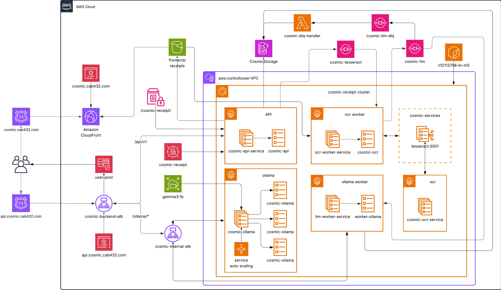

# Receipt App (multi-container)

This repository contains a multi-container receipt-processing application that was originally developed to run locally with Docker Compose but is intended to be deployed and operated using AWS services (ECS, ECR, ALB, SQS, S3, EFS, ElastiCache, etc.).

Developed under the CAB432 Cloud Computing unit at Queensland University of Technology (QUT) using provided AWS resources.

Live demo: [cosmic.cab432.com](https://cosmic.cab432.com/)

This project has practical applications beyond academia. I plan to deploy a personal version soon.

This README provides context about the app, technologies used, a quick local run guide, and a focused reference for deploying the services to AWS ECS.
## Table of contents

- [Project overview](#project-overview)
- [Technologies](#technologies)
- [Architecture diagram](#architecture-diagram)
- [Running locally (development)](#running-locally-development)
- [Deploying to AWS ECS (reference guide)](#deploying-to-aws-ecs-reference-guide)
	- [High-level checklist](#high-level-checklist)
	- [Task and service hints](#task-and-service-hints)
	- [Persistent data & volumes (ollama)](#persistent-data--volumes-ollama)
	- [Secrets & configuration](#secrets--configuration)
- [Troubleshooting & tips](#troubleshooting--tips)
- [Contributing](#contributing)
 - [Contributing](#contributing)

## Project overview

This app is a receipt-processing stack composed of multiple microservices:
- frontend: Vite + React UI
- api: Node.js backend (Express) serving API endpoints
- ocr-worker: worker that performs OCR using a Tesseract container
- llm-worker: worker that performs LLM processing (calls Ollama or another LLM endpoint)
- tesseract: container providing the Tesseract binary/service
- ollama: local model runtime (gemma3 etc.) used by llm-worker in some setups
- memcached: caching (used locally; in AWS use ElastiCache)

Local development is supported by the repository's Docker Compose files:
- `docker-compose.dev.yml` — development compose with local mounts and rebuild/watch hints
- `docker-compose.yml` — example/production compose that references pre-built images

The project's original intention was to run on AWS using managed services (ECS, ECR, ALB, SQS, S3, ElastiCache, EFS). The README below focuses on a practical reference for that deployment model while still describing how to run locally.

## Technologies

- Frontend: React, Vite, Typescript
- Backend: Node.js (Express), JavaScript
- Workers: Node.js processes (ocr-worker, llm-worker)
- Model runtime: Ollama (container), local pull/persist of models (EFS in AWS)
- OCR: Tesseract (containerized)
- Cache: Memcached (local) / ElastiCache (AWS)
- Queueing & storage: SQS, S3
- Container tooling: Docker, Docker Compose, ECR, ECS (Fargate or EC2), EFS for persistent volumes

## Architecture diagram



*Architecture: high-level AWS services and container relationships*

*Diagram & design — created by Kevin Romero (Nov 2025)*

## Running locally (development)

Prerequisites
- Docker Desktop (with Compose)
- Optional: Node.js and pnpm/yarn/npm if you want to run or build individual services locally
- Make sure you bind mount your AWS credentials onto the docker containers that need it (both workers and the API containers)

Bring up the full dev environment (PowerShell):

```powershell
# From repo root
docker-compose -f docker-compose.dev.yml up --build
# or, if using docker compose v2
docker compose -f docker-compose.dev.yml up --build
```

Notes:
- The dev compose mounts local code into containers for quick iteration. If you change code you may need to restart containers.
- The compose file expects `%USERPROFILE%\\.aws` to exist if the services rely on AWS credentials. Adjust or remove the volume if you do not want credentials mounted.
- The `ollama` service in `docker-compose.dev.yml` uses a persistent Docker volume named `ollama`; locally that keeps pulled models.

To tear down:

```powershell
docker-compose -f docker-compose.dev.yml down -v
```

## Deploying to AWS ECS (reference guide)

This section is a focused reference for converting the multi-container setup to AWS ECS (production). The intent is not a full tutorial but a practical checklist and examples to accelerate your deployment. Details like exact IAM permissions, VPC/Subnet IDs, or exact task sizes should be chosen based on your AWS account and constraints.

High-level approach
1. Create ECR repositories for each service (api, ocr-worker, llm-worker, frontend if serving an SSR container or static site image).
2. Build and push container images to ECR.
3. Create ECS Task Definitions (one per service). Consider using Fargate for simplified ops; 
4. Setup networking: VPC, subnets, routes, Security Groups. Create an ALB for the `api`/frontend entry points.
5. Create ECS Services for each task definition, attach to ALB target groups where needed.
6. For data/queue: create S3 buckets, SQS queues, and related resources.
7. For persistent model storage (Ollama data), create an EFS filesystem and attach it to the tasks as a volume (or run Ollama on an EC2 host and share the EFS mount).
8. For caching replace local Memcached with ElastiCache (Memcached or Redis).

### High-level checklist (AWS resources)
- ECR repositories for each image
- IAM roles: Task role (for S3/SQS access), Execution role (ECS), service role
- ECS cluster (Fargate recommended) + ECS services
- ALB + listeners + target groups
- S3 bucket(s) for storage
- SQS queues for worker communication
- EFS for persistent volumes used by Ollama
- ElastiCache for caching (if needed)
- CloudWatch logs & metrics
- Congnito for authentication and authorization

### Task and service hints
- Container size / CPU / memory: tune by testing. Workers may need more CPU for Tesseract and LLM tasks.
- Concurrency: run multiple worker tasks and scale using SQS queue length-based autoscaling.
- Health checks: configure container-level health checks in ECS to restart unhealthy containers.
- Environment: put non-sensitive settings in ECS task environment variables and secrets (see below).

Example (simplified) container definition notes
- api: attach to ALB, map port 3000
- tesseract: may be run as its own task (internal) and referenced by workers via an internal URL (private ALB or service discovery)
- ollama: needs persistent model storage (EFS) — see next section

### Persistent data & volumes (ollama)

`ollama` stores model files and runtime data in a persistent folder. Locally this is a Docker volume named `ollama`. In AWS/ECS you should use EFS (network file system) mounted into the Ollama container task (or run Ollama on EC2 and expose it privately):
- Create an EFS filesystem in the same VPC as ECS
- Create EFS access points and mount targets in the subnets
- Add an ECS volume referencing the EFS filesystem in the task definition
- Mount the volume into the Ollama container (e.g. `/root/.ollama`)

### Secrets & configuration
- Do NOT embed secrets in images or source. Use AWS Secrets Manager or SSM Parameter Store for DB passwords, API keys, and credentials.
- ECS Task Definitions can reference Secrets from Secrets Manager and inject them as environment variables.

## Troubleshooting & tips
- Local: if containers fail to start, run `docker-compose -f docker-compose.dev.yml logs <service>` to inspect logs.
- Ollama: model pull can take time. Ensure `ollama` has the right persistent volume and enough disk space.
- Tesseract: check the tesseract healthcheck, and ensure the worker can reach the tesseract service URL.

## Contributing
- This project does need some lovin, consider linting across all components, maybe tools like `biome`/`ultracite` can help standarize the codebase, as just the frontend has `eslint` and `prettier` configured (by default at project initiation)
- For changes that affect deployment (task size, volumes, env variables) update this README and add a short migration note.

---
_Last updated: 2025-11-13_
